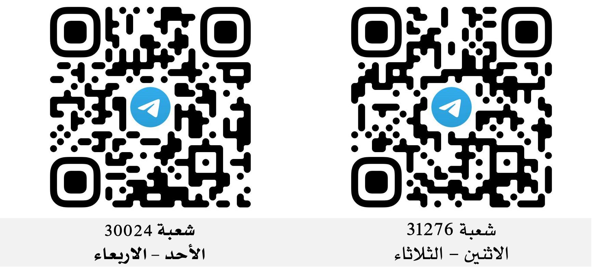

# مقرر مبادئ برمجة صفحات الإنترنت
### وصف المقرر:
يقدم هذا المقرر مجموعة من المهارات الأساسية والموضوعات التي تمكن المتدرب من إنشاء موقع على الإنترنت. يتم التدرب على مبادئ تصميم الموقع واستخدام الأدوات الأساسية اللازمة لإنشاء الصفحات مثل لغة التميز (HTML). يتضمن المقرر موضوع النماذج (Forms) التي تُستخدم لإحداث التفاعل بين الصفحة والزائر للموقع، بالإضافة إلى التدريب على المهارات الأساسية لتصميم الأنماط الانسيابية (CSS) للتحكم في طريقة عرض الموقع. كما يقدم المقرر المهارات والموضوعات الأساسية التي تمكّن المستخدم من استخدام أحد برامج تصميم صفحات الإنترنت، مع التركيز على تحرير وإنشاء الصور بشكل مبسط. بالإضافة إلى ذلك، يتعرف المتدرب على لغة JavaScript واستخدامها في برمجة جانب العميل والتعامل مع الدوال (Functions) والأحداث (Events) واستخدامها في فرض قيود للتحقق من صحة البيانات المدخلة في النموذج.

---
### توزيع المقرر على الأسابيع الدراسية

| **الأسبوع** | **الموضوع**                                                              | **عدد الساعات** |
| ----------- | ------------------------------------------------------------------------ | --------------- |
| 1           | مقدمة عن الشبكة العالمية للمعلومات: تعريف الإنترنت والويب، الفرق بينهما. | 4               |
| 2           | مكونات مواقع الويب: عناوين URL، الخوادم، والبروتوكولات.                  | 4               |
| 3           |  (إجازة أو تأخير بسبب الظروف الجوية)                        | 4               |
| 4           | مقدمة إلى HTML: الوسوم الأساسية، الهيكل الأساسي لصفحات الويب.            | 4               |
| 5           | HTML: تنسيق النصوص، إضافة الصور، الروابط التشعبية.                       | 4               |
| 6           | HTML: القوائم والجداول.                                                  | 4               |
| 7           | النماذج (Forms): فهم وإنشاء النماذج.                                     | 4               |
| 8           | **الاختبار النصفي الأول.**                                               | 4               |
| 9           | CSS: مقدمة إلى CSS، التحكم في مظهر الصفحات.                              | 4               |
| 10          | CSS: تخطيط الصفحة، الألوان والخطوط، الإطارات والمسافات.                  | 4               |
| 11          | JavaScript: مقدمة إلى البرمجة النصية، تعريف المتغيرات والدوال.           | 4               |
| 12          | **الاختبار النصفي الثاني.**                                              | 4               |
| 13          | JavaScript: الأحداث (Events)، التفاعلية مع المستخدم.                     | 4               |
| 14          | النماذج (Forms): التحقق من صحة البيانات باستخدام JavaScript.             | 4               |
| 15          | فهم الأحداث (Events) والدوال (Functions).                                | 4               |
| 16          | **عرض المشروع النهائي - الاختبار العملي النهائي**                                                     | 4               |

---

## **معلومات المدرب**

- **الاسم:** د. محمد الحربي
- **البريد الإلكتروني:** msalharbi@tvtc.gov.sa
- **الساعات المكتبية:** [TBD]
- **موقع المكتب:** 03/0120
- - **قناة التليجرام:** 

---

## **أهداف المقرر**

1. التعرف على المفاهيم الأساسية لتصميم المواقع.
2. اكتساب المهارات العملية اللازمة لإنشاء صفحات الويب.
3. تعلم استخدام HTML وCSS وJavaScript.
4. تطوير القدرة على إنشاء مواقع تفاعلية.
5. التحقق من البيانات المدخلة في النماذج باستخدام تقنيات حديثة.

---

## **الدرجات**

| **العنصر**              | **النسبة المئوية** |
|-------------------------|-------------------|
| الحضور والمشاركة        | 10%              |
| الاختبارات الشهرية      | 30%              |
| الواجبات والمشاريع       | 20%              |
| الاختبار النهائي - نظري | 27%              |
| الاختبار النهائي - عملي | 13%              |

---

## **أدوات المقرر و المراجع**

1. **أدوات البرمجة: Visual Studio Code, Notepad++**.
2. **مصادر إضافية:**
   - [W3Schools](https://www.w3schools.com)
   - [MDN Web Docs](https://developer.mozilla.org/en-US/)

---

## **ملاحظات مهمة**

- الالتزام بالمواعيد النهائية لتسليم الواجبات.
- ضرورة الحضور والمشاركة في الأنشطة العملية.
- يتم تحديث الموارد والدروس بشكل دوري عبر GitHub repository الخاص بالمقرر.

